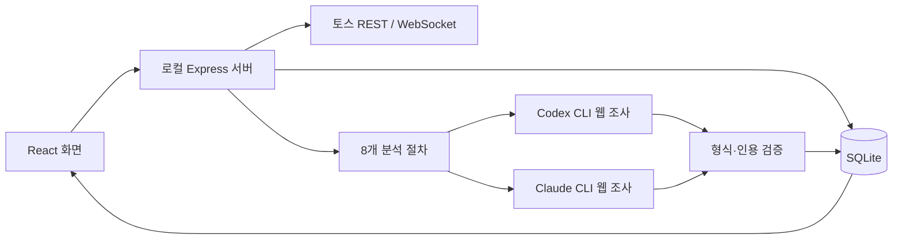

# 구현 구조

2026-09-05~06 · 로컬 개인용 OMS v0.1

React 19/TypeScript/Vite, Node.js 24/Express 5, 내장 SQLite, Decimal.js를 사용한다. 화면과 API를 같은 서버에서 제공하며 개발 모드만 Vite middleware를 사용한다. 로컬 CLI 실행이 필요하므로 Cloudflare/Sites 호스팅은 사용하지 않는다.

## 코드의 책임

| 위치                                    | 책임                                           |
| --------------------------------------- | ---------------------------------------------- |
| `src/App.tsx`                           | 내비게이션, 상태 갱신, 대시보드, 보유 표       |
| `src/Advisor.tsx`                       | 자동 조사 카드, 모델·강도 선택, 비교·읽기 화면 |
| `src/AnalysisProgress.tsx`              | 원형 스피너, 현재 상태 문구, 경과 시간, 검색 횟수 |
| `src/History.tsx`                       | 실행 입력·답변 기록, 검색, 프롬프트 라이브러리 |
| `src/DailyBrief.tsx`, `server/brief.ts` | 한국시간 기준 브리핑, 지수·일정·출처 표시      |
| `src/InvestorProfile.tsx`               | 투자 성향·목표·자금 필요·제외 조건 설정        |
| `src/views.tsx`                         | 입력·CSV, 리서치, 시뮬레이션, 기록, 설정       |
| `src/ui.tsx`, `src/styles.css`          | 공통 UI, 관측값 차트, 반응형 디자인            |
| `server/app.ts`                         | API, 잔고 동기화, 분석 작업 생명주기           |
| `server/providers.ts`                   | CLI 탐색·로그인 확인·실행·취소·파싱            |
| `server/skills.ts`, `analysis-skills/`  | 공통 조사 규칙, 출력 스키마, 분야별 절차       |
| `server/toss.ts`, `server/stream.ts`    | 공식 조회 API, 토큰, 체결 구독                 |
| `server/finance.ts`                     | 통화 환산, 평가손익, 비중·현금 제약            |
| `server/store.ts`                       | SQLite 저장·트랜잭션·백업                      |
| `tests/`, `scripts/`                    | 회귀 테스트, 연결 검사, Windows 실행 도구      |

## 분석 작업

`POST /api/analyses`는 유형, 질문, 대상, 선택 자료, 모델·강도, 자동 조사 여부를 받는다. 서버에서 포트폴리오·환율·원칙을 같은 시점으로 고정하고 계좌번호와 보유 레코드 내부 ID를 AI 입력에서 제거한다. 숫자는 계산 엔진의 결과를 전달한다.

각 모델은 공통 지침과 해당 `analysis-skills/*.md` 절차를 실행한다. 이 파일은 OMS 작업 템플릿이며 CLI에 설치한 네이티브 skill이나 별도 서버는 아니다. 화면에서 수정한 기준은 SQLite `templates`에 저장되어 기본 파일보다 우선한다.

자동 조사에서는 Codex의 `web_search="live"`, Claude의 `WebSearch,WebFetch`를 허용한다. 자료 고정 모드에서는 검색 도구를 끈다. 두 모델 사이에 중간 결과를 공유하지 않는다. 후속 질문에는 같은 공급자의 이전 결과만 맥락으로 추가한다.

분석 작업은 동시에 2개까지, 작업별로 선택 모델을 병렬 실행한다. 동일하게 진행 중인 요청은 합친다. 완료된 자동 조사는 새로고침할 때 다시 조사한다. 자료 고정 모드는 동일 입력의 완료 결과를 재사용할 수 있다. 자동 조사는 최대 10분, 자료 고정 분석은 최대 5분이다.

대기 → 진행 → 완료/일부 완료/실패/취소 상태로 저장한다. 서버 재시작 시 미완료 작업은 중단으로 바꾼다. 취소는 해당 CLI 프로세스 트리에만 적용한다. 한 모델의 재시도는 새 작업을 만들며 이전 성공 결과를 덮어쓰지 않는다.

## 실행 진행 상태와 상세 기록

CLI 실행 중 5초마다 로컬 프로세스의 실행 상태를 갱신한다. 실제 출력 수신 시각(`lastEventAt`)과 로컬 실행 확인 시각(`heartbeatAt`)은 구분한다. 공개 이벤트에서 연결·검색·작성·검증 단계와 중복 제거한 검색 도구 ID를 추출한다. 검색 횟수는 완료율이나 비용 지표가 아니다. 원시 웹 요청·응답과 내부 사고 내용은 기록하지 않는다.

화면은 실행 중 약 1.5초, 평소 5초 간격으로 상태를 조회한다. 응답 순서가 뒤바뀌어 이전 상태로 돌아가지 않도록 요청 순서를 검사하며 통신 실패는 마지막 정보와 함께 알린다. 경과 시간은 별도 1초 타이머다. `prefers-reduced-motion` 환경에서도 타이머와 상태 텍스트는 갱신한다. 정상 동작 환경의 진행바는 완료율 없는 애니메이션이다.

`traces` 레코드는 작업 ID와 공급자 조합으로 저장한다. 실행 직전에 OMS가 CLI 표준 입력에 전달할 정확한 문자열, 공통 지침, 템플릿, 질문, 모델·강도, 출력 스키마, 당시 투자 입력·참고 자료를 고정한다. CLI에 입력을 쓴 시점과 최종 답변 수신·완료 시각도 기록한다. 토스 인증값·계좌 식별자는 포함하지 않는다. 최종 답변은 Codex의 `agent_message` 또는 Claude의 최종 결과/구조화 응답에서만 추출하며 실패한 형식 검증의 답변도 보관한다.

검색 활동 등 타임라인은 최대 200개와 생략 개수를 저장한다. 하트비트마다 타임라인을 늘리지 않는다. 서버 재시작 시 미완료 작업과 해당 trace를 중단으로 마감한다. 재시도는 새 작업·새 trace를 만들며 이전 입력·답변을 변경하지 않는다. 예전 버전의 작업에 trace가 없으면 과거 전송문을 현재 템플릿으로 재구성하지 않는다.

| API                                                 | 용도                                          |
| --------------------------------------------------- | --------------------------------------------- |
| `GET /api/history?q=&skill=&status=&offset=&limit=` | 기본 20건, 최대 50건의 가벼운 실행 목록       |
| `GET /api/history/:id`                              | 작업과 모델별 입력·답변 trace                 |
| `GET /api/history/:id/export`                       | 해당 작업의 JSON 내보내기                     |
| `GET /api/prompts`                                  | 현재 공통 지침·분야별 템플릿·기본값·응답 형식 |
| `PUT /api/profile`                                  | 투자 성향과 목표 저장                         |

일반 `/api/state` 응답에는 trace 원문을 중복 포함하지 않는다. SQLite·전체 JSON 백업은 trace를 포함하며 암호화하지 않는다.

## 투자 프로필과 데일리 브리프

`meta/profile`은 투자 성향, 투자 경험, 목표 내용·금액·통화·시점, 감내 하락률, 가까운 자금 필요, 제외 조건을 보존한다. 기본값은 미지정 또는 빈 문자열이다. 금액·0~100%·실제 달력 날짜를 검증한다. 프로필과 기존 비중·현금 원칙을 매 분석의 고정 입력과 중복 요청 판단에 포함한다. 설정 변경은 미래 작업에만 적용된다. 목표와 제약의 충돌 및 미입력 사항을 명시하도록 공통 지침에 추가했다.

`daily` 작업은 웹 조사를 사용한다. 브리핑 요청 시 `briefWindow`에 한국시간 날짜, 기준 시각, 해당 날짜의 시작·끝, 기준 시각부터 72시간 끝을 고정한다. 미국 서머타임을 고정 시차로 추정하지 않는다. 모델이 공식 출처에서 확인한 실제 시차 포함 ISO 일정을 화면에서 한국시간으로 변환한다. 확인되지 않은 시각은 `null`과 설명문, 추정 일정은 `tentative`다.

`dailyBrief`에는 시장 상태, 출처·기준 시각이 있는 지수, 경제·실적·시장 일정, 우선 확인 항목이 포함된다. 오늘 일정과 나머지 가까운 일정을 분리해서 표시한다. 브리핑 날짜 불일치, 출처 없는 지수·일정, 존재하지 않는 인용 ID는 검증 실패로 처리한다. 다른 분석에서는 `dailyBrief=null`을 사용하며 기존 저장 결과의 누락 필드는 허용한다. 스키마 파일명은 내용 해시를 사용해 이전 CLI 스키마 캐시의 영향을 막는다.

일반 질문의 종목 선택·부모 작업·선택 자료를 데일리 브리프 화면에서 이어받지 않는다. 전체 포트폴리오와 투자 프로필을 기준으로 새로 조사한다. 일정을 예약하거나 앱이 꺼진 상태에서 실행하지 않는다.

## 결과와 근거

결과는 핵심 판단, 요약, 주요 항목, 수치, 사실, 영향, 행동, 반대 근거, 재검토 조건, 미확인 항목, 출처 배열로 구성된다. 한국어 출력, 원문 숫자·통화·배율 보존, 한국어 환산 시 원문 수치 병기를 지시한다.

CLI 구조화 출력과 Zod로 형식을 확인하고 `evidenceIds`가 제공 자료·모델 출처·`portfolio-snapshot` 중 하나를 가리키는지 검증한다. 검색 이벤트나 출처가 없으면 최신성을 확인할 수 없다고 표시한다. 이벤트 수는 공급자마다 의미가 달라 공통 비용 척도로 쓰지 않는다.

**형식·인용 검증은 사실 검증이 아니다.** 모델이 잘못 읽거나 출처·숫자를 잘못 작성할 수 있다. 원문 확인 범위도 모델의 보고다. 주요 수치 옆의 출처와 모델별 근거를 확인할 수 있게 한다. 서로 다른 수치를 평균하거나 두 모델의 동의를 투자 확신 점수로 바꾸지 않는다.

AI 출처는 리서치 노트에 한국어 제목과 링크로 저장한다. 원문 전체를 보관한 것처럼 표시하지 않는다. RSS는 제목·링크, 사용자 붙여넣기는 원문 자료로 구분한다.

## 포트폴리오 계산과 관측

수량·평균단가·현재가는 문자열 Decimal로 유지한다. `평가액 = 수량 × 현재가`, `평가손익 = 평가액 − 수량 × 평균단가`다. 원가가 0이면 수익률을 만들지 않는다. 원화 보유분은 동일한 USD/KRW 매매기준율로 달러 환산한다.

현금 확인 후에만 합계에 현금을 포함한다. 현금 미확인 시 종목 평가액만 표시하고 배분 계산을 막는다. 필요한 시세·환율이 없으면 합계는 미확인이다. 매입 시점 환율 이력이 없어 실제 환차익을 따로 계산하지 않는다.

리밸런싱 탭은 계산 시뮬레이션 대신 `rebalance` 분석 스킬로 AI 제안을 받는다. 응답의 `rebalance.proposals`는 종목별 action(keep/add/trim/exit/new), 현재·제안 비중, 이유와 근거 ID를 담고 일반 분석과 같은 인용 검증을 거친다. `server/finance.ts`의 `simulate`는 테스트로 검증된 계산 함수로 남아 있지만 화면·API에서는 사용하지 않는다. 대시보드 주요 뉴스는 `headlines` 스킬이며 외부 출처 ID가 없는 항목은 실패로 처리하고, 실행 시 저장 모델·강도 설정을 덮어쓰지 않는다. 카드의 AI·모델 선택은 `settings.headlines`(`PUT /api/settings/headlines`)에 따로 저장하며 기본 공급자는 `codex`다. 화면은 저장된 선택이 로그인되지 않은 경우 로그인된 AI로 대체해 요청하고, 각 항목의 `importance`(high/medium/low)를 라벨로 보여준다. 완료된 실행의 `validation`(웹 검색·출처 미확인 경고)은 카드에 함께 표시한다. `/api/state`의 `jobs`는 최근 30개에 최신 `headlines` 작업을 항상 포함한다. `/api/analyses/:id/retry`는 원래 작업을 복사하지 않고 현재 공통 지침·템플릿·포트폴리오 입력으로 새 작업을 만든다.

동기화·시세 갱신·보유 및 현금 변경, 서버 실행 중 15분 간격으로 스냅샷을 저장한다. 현재 화면은 최근 300개를 조회하며 전체 기록은 DB·백업에 남는다. 차트는 입출금·보유 변경을 포함한 관측 평가액이며 투자 성과 지수가 아니다.

## 토스 연결과 로컬 보호

- REST 주소와 조회 경로를 고정하고 주문 경로는 네트워크 요청 전에 차단한다.
- OAuth 토큰은 메모리에 캐시하며 동시 발급을 합친다. 토스는 클라이언트당 한 토큰만 유효하므로 여러 서버·별도 검사 프로세스를 동시에 실행하지 않는다.
- REST 체결 시각과 잔고 조회 시각을 구분한다. 잔고만 확보하면 체결 시각은 미확인이다.
- WebSocket은 60초 PING, 구독 응답 확인, 지연 재연결을 수행한다. 종목 조회는 200개, 체결 구독은 100개까지 사용한다.
- 서버는 `127.0.0.1`에 바인딩하고 Host/Origin·변경 요청 토큰을 확인하며 API 캐시를 금지한다.
- `.env`는 실행 진입점에서만 로드한다. 토스 비밀값은 AI 환경과 API 응답에 포함하지 않는다.
- CLI는 `.runtime/analysis`에서 실행한다. Codex는 셸 비활성·읽기 전용, Claude는 안전·제한 모드에서 웹 도구만 사용하고 외부 MCP를 로드하지 않는다.
- 개인 포트폴리오는 사용자가 선택한 AI 서비스로 전달된다. 로컬 앱이 오프라인 추론을 의미하지 않는다.
- 뉴스 RSS에 보유 티커를 보내는 옵션은 기본으로 꺼져 있으며 사용자가 직접 선택한다.
- DB는 SQLite WAL, 스키마 버전 1, `(kind,id,payload)` 구조다. 보유·환율 갱신은 트랜잭션으로 적용한다. DB와 JSON 백업은 암호화하지 않는다.

## 원격 실행과 읽기 화면

원격 개인 접속은 `server/access.ts`와 `deploy/oms.service`로 준비했다. 기본은 localhost 모드이고, `OMS_REMOTE_ORIGIN`·`OMS_REMOTE_USER`를 함께 지정하면 Tailscale Serve의 본인 로그인 신원과 loopback 프록시 요청을 모든 경로에서 검사한다. 원격 모드에는 인증 없는 localhost 예외가 없다. HTTPS 원본·Host·기존 변경 토큰 검사를 유지하며 공개 CORS를 추가하지 않는다. 실제 배포 절차와 미검증 항목은 [CLOUD-DEPLOYMENT.md](CLOUD-DEPLOYMENT.md)에 구분한다.

CLI 모델 캐시 경로는 `CODEX_HOME` 또는 OS 홈의 `.codex`를 사용한다. Windows 취소는 `taskkill`을 유지하고 POSIX에서는 전용 프로세스 그룹에 SIGTERM을 보낸다. Linux systemd 서비스와 CLI sandbox·프로세스 종료 동작의 실서버 검증은 남아 있다.

`ReportText`는 저장된 답변을 수정하지 않고 표시 단계에서 문장 경계를 이용해 긴 문단을 나눈다. 보고서·브리핑의 본문, 강조 항목, 영향과 행동에 적용한다. 반응형 열 배치와 본문/출처의 시각적 구분은 CSS가 담당한다.

## 확장 순서

정기 실행 시간·알림 빈도·사용량 예산을 정한 뒤 예약 브리핑을 추가한다. 이후 거래·배당 기반 수익률, 장기 스냅샷 집계, ETF 간접 노출, PDF 수집을 확장할 수 있다. 현재 새로고침 기반 자동 조사와 구분하여 구현·검증한다.
