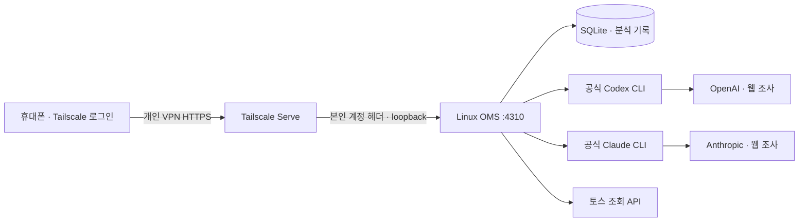

# PC를 꺼도 사용하는 개인 OMS

2026-09-07 기준 배포 준비 문서다. 사용자는 집 밖 휴대폰 접속, 새 AI 질문·최신 자료 새로고침, 월 1만 원 이내의 새 서버를 원한다. **접근 제어 코드와 실행 템플릿만 준비했으며 서버 개설·결제·실제 배포는 아직 하지 않았다.** 상품·금액·약정 확인이 마지막 승인 단계다.

## 제안과 비용

Linux x86 VPS에 OMS, SQLite, 공식 Codex·Claude CLI를 함께 두고 Tailscale Serve로 본인 휴대폰에만 HTTPS를 제공한다. PC 전원은 필요 없다. AI 계산은 각 공급자의 서비스에서 수행하므로 GPU 서버는 필요하지 않다. 2 vCPU·4GB RAM을 시작 사양으로 제안하지만 두 모델 동시 실행의 실제 메모리와 대기 시간은 배포 후 측정해야 한다.

| 항목      | 검토한 조건                                                                                          |
| --------- | ---------------------------------------------------------------------------------------------------- |
| 서버 후보 | netcup VPS Lite 1 G12s, Linux x86, 2 vCore, RAM 4GB, SSD 80GB                                        |
| 위치      | 유럽 자동 배정: Nuremberg / Vienna / Amsterdam                                                       |
| 네트워크  | IPv4 + IPv6 포함 구성                                                                                |
| 표시 요금 | 월 €4.88, 독일 VAT 19% 포함 표시, 설치비 €0                                                          |
| 약정·청구 | **최소 6개월, 6개월 단위 청구: €29.28**                                                              |
| 원화 참고 | 2026-09-04 ECB 기준 €1 = 1,569.38원 적용 시 월 약 7,659원, 6개월 약 45,951원                         |
| 비용 여유 | 카드 환전·수수료를 3%로 가정하면 월 약 7,889원 / 6개월 약 47,330원. 실제 수수료가 확인된 견적은 아님 |
| 개인 VPN  | Tailscale Personal 무료 범위 사용, 별도 도메인 불필요                                                |
| AI 비용   | 기존 구독·CLI 사용 한도 사용. 서버 요금에 AI 구독료가 포함되는 것은 아님                             |

[공식 상품·약정·IPv4 요금](https://www.netcup.com/en/server/vps/vps-lite-1-g12s-iv-6m), [ECB 환율](https://www.ecb.europa.eu/stats/policy_and_exchange_rates/euro_reference_exchange_rates/html/index.hr.html), [Tailscale 요금](https://tailscale.com/pricing)을 확인했다. 가입 국가의 세금, 결제 시점 환율·수수료에 따라 청구액은 바뀐다. 가입 후 장바구니의 실제 총액을 확인하고, 월 환산 1만 원을 초과하면 결제하지 않는다. 6개월 청구에 동의하지 않으면 다른 상품을 다시 선정한다. 할인·쿠폰은 전제하지 않는다.

유럽 위치의 지연과 토스 API의 해당 서버 IP 접근 가능 여부는 아직 확인하지 못했다. VPS 가동만으로 AI 공급자 장애·구독 한도·재로그인 요구가 사라지지는 않는다.

## 연결 구조



휴대폰은 OMS 화면에 질문을 보내고 서버가 두 CLI를 실행한다. 화면을 잠시 닫아도 서버의 작업은 이어지며 나중에 히스토리에서 확인할 수 있다. 서버 종료 중에는 새 작업이 실행되지 않는다. 정기 예약 브리핑은 별도 미구현이다.

`server/access.ts`가 원격 모드의 **모든 화면·조회·변경 요청**에 본인 Tailscale 계정을 요구한다. Serve의 `Tailscale-User-Login`과 설정된 계정이 같아야 한다. TCP 상대가 loopback인지도 확인한다. Host·Origin 검사와 변경 요청의 `X-OMS-Token` 검사를 유지한다. 설정 일부만 입력하면 시작 단계에서 실패한다.

기본 모드는 기존 localhost 전용이다. 원격 모드에서는 인증 없는 localhost 요청도 403이다. 임의의 프록시, 공개 Funnel, 공개 4310 포트로 연결하지 않는다. Serve가 외부의 위조된 신원 헤더를 제거하는 동작에 의존하므로 OMS는 계속 `127.0.0.1`에 바인딩한다. 서버 내부 계정은 신뢰 경계이며 다중 사용자를 위한 서비스가 아니다. [Serve의 신원 헤더 설명](https://tailscale.com/docs/features/tailscale-serve)

## 승인 이후 설치 순서

아래는 **원격 Linux 서버에서 실행할 절차**다. 현재 Windows PC에 실행하지 않는다.

1. 승인된 상품을 사용자 계정으로 개설한다. Linux x86의 지원 중인 Ubuntu LTS를 선택한다. SSH 키와 기본 방화벽을 설정하고 4310은 공개하지 않는다. 운영자 SSH 접근을 확인한 뒤 접근 규칙을 좁힌다.
2. 시스템 PATH(`/usr/local/bin` 또는 `/usr/bin`)에 Node.js 24 이상과 pnpm 11.19.0을 설치한다. 프로젝트의 `packageManager`와 lockfile을 따른다. `oms` 일반 계정을 홈 `/home/oms`와 함께 만들고, 이 계정으로 설치·CLI 로그인·서비스를 실행한다.
3. Tailscale을 공식 Linux 설치 문서에 따라 설치하고 본인 계정으로 연결한다. 휴대폰에도 Tailscale 앱을 설치해 같은 개인 네트워크에 로그인한다. [공식 Linux 설치](https://tailscale.com/docs/install/linux)
4. 서버의 `oms` 계정에서 다음을 실행한다. Windows의 `node_modules`, `.runtime`, CLI 인증 파일을 그대로 복사하지 않는다.

```sh
git clone https://github.com/RGLie/oh-my-stock.git /home/oms/oh-my-stock
cd /home/oms/oh-my-stock
pnpm install --frozen-lockfile
pnpm test
pnpm build
```

의존성에는 공식 두 CLI와 서버 런타임 `tsx`가 들어 있으므로 `--prod`만 설치하면 안 된다. 두 CLI 실행 파일과 `node --version`을 확인한다.

```sh
node node_modules/@openai/codex/bin/codex.js --version
node_modules/@anthropic-ai/claude-code/bin/claude --version
node node_modules/@openai/codex/bin/codex.js login --device-auth
node_modules/@anthropic-ai/claude-code/bin/claude auth login
```

로그인은 사용자가 공식 인증 페이지에서 마친다. Codex 기기 코드 로그인이 비활성화되어 있으면 공식 계정 설정에서 허용해야 한다. Claude는 CLI가 제공하는 로그인 URL과 안내를 따른다. 실제 서버에서 두 흐름을 확인해야 하며 토큰을 대화나 저장소에 붙여넣지 않는다. [Codex 인증](https://developers.openai.com/codex/auth/), [Claude 인증](https://code.claude.com/docs/en/authentication)

5. 기존 `.env`를 안전하게 이전하거나 `.env.example`을 바탕으로 작성하고, `oms` 소유·권한 600으로 설정한다. 서버에서는 Windows의 `CODEX_CLI_PATH`·`CLAUDE_CLI_PATH` 값을 비워 프로젝트의 Linux 실행 파일을 사용한다. `CODEX_HOME`을 별도 지정했다면 로그인 환경과 서비스 환경을 일치시킨다. CLI 인증과 DB는 Git에 넣지 않는다.
6. 아래 Serve 명령으로 개인 HTTPS 주소를 발급한다. 최초 HTTPS 활성화는 명령이 안내하는 계정 페이지에서 완료한다. 발급된 **실제 주소와 본인 로그인 계정**으로 `.env`의 두 항목을 설정한다. 예시를 그대로 사용하지 않는다.

```sh
sudo tailscale serve --bg http://127.0.0.1:4310
sudo tailscale serve status
```

```dotenv
OMS_REMOTE_ORIGIN=https://실제-호스트.실제-tailnet.ts.net
OMS_REMOTE_USER=본인의-Tailscale-로그인
```

`--bg`는 재부팅 후에도 Serve 설정을 유지한다. tagged 기기나 공유된 다른 계정은 본인 로그인 신원과 일치하지 않아 접근되지 않을 수 있다. [Serve 명령과 지속성](https://tailscale.com/docs/reference/tailscale-cli/serve)

7. `deploy/oms.service`의 경로와 Node PATH를 확인한 뒤 등록한다. Linux 서비스는 준비된 템플릿이며 아직 실제 VPS에서 검증하지 않았다.

```sh
sudo install -m 644 deploy/oms.service /etc/systemd/system/oms.service
sudo systemctl daemon-reload
sudo systemctl enable --now oms
sudo systemctl status oms --no-pager
```

서비스는 `oms`로 실행하고 SQLite·CLI 홈을 유지한다. 서버 장애 후 재시작하며 프로세스 트리도 함께 종료한다. **로그인·키 접근, Codex의 Linux sandbox, CLI 동시 실행·취소를 실제 systemd 환경에서 검사한 뒤 운영 완료로 판단한다.**

## 데이터 이전과 확인

처음에는 토스 키가 없는 빈 서버로 화면·VPN·공개 주제 AI 분석을 확인한다. 실제 자료를 이전할 때는 다음 순서를 따른다.

1. PC에서 진행 중 AI 작업이 없는지 확인하고 JSON 백업을 다운로드한다. PC의 OMS를 정상 종료한다.
2. 종료된 DB의 `data` 폴더와 `.env`를 인증된 SSH 경로로 서버에 이전한다. SQLite가 실행 중이면 파일 하나만 복사하지 않는다. 서버의 `data` 폴더와 `.env`는 `oms`만 읽고 쓸 수 있도록 보호한다.
3. 클라우드 `.env`의 원격 주소·계정과 Linux CLI 경로를 재확인하고 OMS를 시작한다. **토스는 클라이언트당 유효 토큰 하나이므로 PC와 VPS에서 동시에 토스 연결을 실행하지 않는다.**
4. 보유 종목·현금·투자 목표·과거 분석·상세 기록의 보존을 확인한다. 토스 조회와 시세 갱신을 확인하고, 공개 질문으로 두 CLI의 검색·한국어 응답·진행 상태·취소를 확인한다.
5. 휴대폰 Wi-Fi를 끄고 Tailscale을 켠 상태에서 접속한다. 화면, 새 질문, 브리프 새로고침, 기록 재열람을 확인한다. VPN 미접속과 다른 계정에서 접근이 거부되는지도 확인한다.
6. 서버 재부팅 후 자동 시작·로그인 유지·과거 기록을 확인한다. 이 단계까지 마치면 PC 전원을 꺼도 이용 가능하다.

데이터는 VPS 디스크에 저장되며 별도 암호화는 하지 않는다. 분석 입력은 선택한 AI 공급자에게 전달된다. 정기적으로 서버 외부의 개인 보관 위치에 백업하고 복원을 확인한다. 같은 VPS의 스냅샷만 남기는 방식은 서버 계정 상실까지 대비하지 못한다. 새 유료 백업 서비스는 추가 승인을 받아 선택한다.

복구 시에는 먼저 클라우드 OMS를 종료하고 최신 데이터의 백업을 확보한다. PC로 복원한다면 원격 설정 두 값을 모두 비우고 PC OMS 하나만 시작한다. 데이터가 남아 있는 서버·디스크는 복원 확인 전에 삭제하지 않는다.

## 현재 검증 경계

- 완료: 원격 설정 검증, 신원 없는 조회·잘못된 계정·Host·Origin·변경 토큰 거부, loopback 조건 검사, 기존 로컬 모드 회귀 테스트, TypeScript/빌드.
- 준비: systemd 템플릿, Linux CLI 홈 경로 탐색과 POSIX 취소 시 프로세스 그룹 종료, 이전·복구 절차.
- 미완료: 서버 구매·청구액 확정, 실제 Linux CLI 로그인·sandbox·자원 사용, 토스의 VPS IP 접근, 실기기 VPN·외부망 접속, 재부팅·복구 검사.
